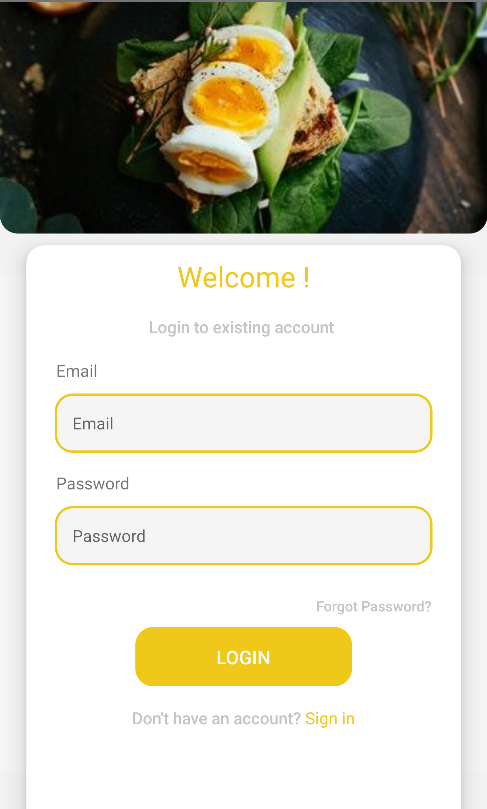
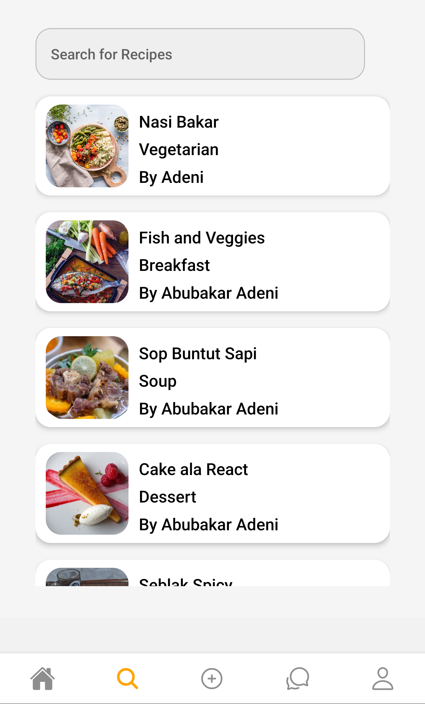
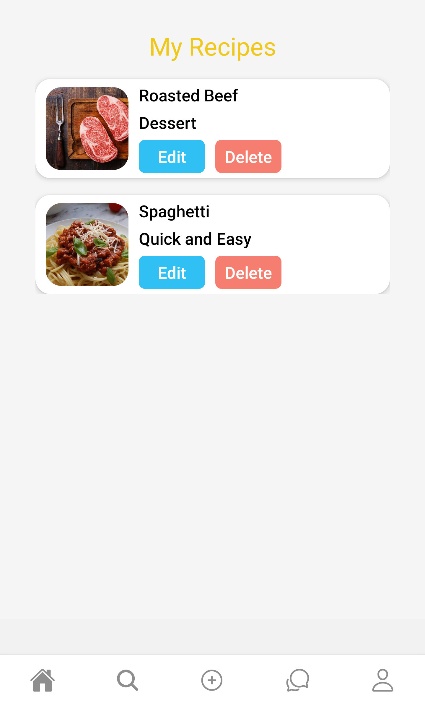

<br />
<p align="center">
  <div align="center">
    
  </div>
  <h3 align="center">Food Recipes (Food App)</h3>
  <p align="center">
    <a href="https://github.com/abubakar-adeni/blanja"><strong>Explore the docs »</strong></a>
  </p>
</p>

## Table of Contents

- [About The Project](#about-the-project)
  - [Built With](#built-with)
- [Getting Started](#getting-started)
  - [Prerequisites](#prerequisites)
  - [Installation](#installation)
- [Screenshots](#screenshots)
- [Related Project](#related-project)

# About The Project

Blanja is an e-commerce platform in the fashion style field where users can log in and enjoy a delightful shopping experience with a highly user-friendly experience.

## Built With

These are the libraries and service used for building this backend API

- 
- 
- 
- 

# Getting Started

## Prerequisites

You'll need these programs installed before proceeding to installation

- [Git](https://git-scm.com/downloads)
- [Node.js](https://nodejs.org/en/download)

This project requires [blanja-app-be](https://github.com/abubakar-adeni/blanja/blob/main/README.md) to function properly, follow the steps provided in the readme to install and run the backend API

## Installation

Follow this steps to run the server locally

1. Clone this repository

```sh
git clone https://github.com/abubakar-adeni/blanja.git
```

2. Change directory to blanja

```sh
cd blanja
```

3. Install all of the required modules

```sh
npm install
```

4. Create and configure `.env.local` file in the root directory, example env are provided in [.env.local.example](./.env.local.example)

```env
NEXT_PUBLIC_HOST=[ Backend URL ]
```

5. Run this command to run the server in development environment

```sh
npm run start
```

- Run this command to build this website into production ready

```sh
npm run build
```

# Screenshots

<table>
 <tr>
    <td></td>
    <td> </td>
  </tr>
  <tr>
    <td>Login</td>
    <td>Register</td>
  </tr>
  <tr>
    <td> </td>
    <td> </td>
  </tr>
   <tr>
    <td>Edit Profile</td>
    <td>Notification</td>
  </tr>
  <tr>
    <td></td>
    <td> </td>
  </tr>
   <tr>
    <td>Search</td>
    <td>Splash Screen</td>
      <tr>
    <td></td>
    <td> </td>
  </tr>
   <tr>
    <td>Upload Recipe</td>
    <td>Edit Recipe</td>
</table>

# Related Project

:rocket: [`https://github.com/abubakar-adeni/foodNative)

:rocket: [`Backend Blanja`](https://github.com/abubakar-adeni/backend-recipes)

:rocket: [`Release APK`](https://github.com/abubakar-adeni/foodNative/tree/main/release)
